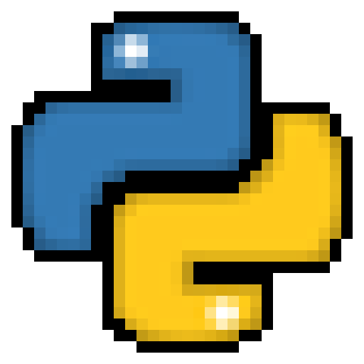
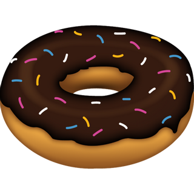
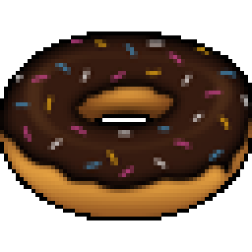
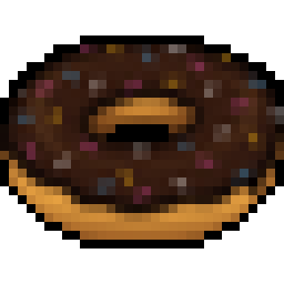

# ImageToPixelArt

## Description

Simple and fast tool to scale down images and make them look like Pixel Art.
It also has a very simple border detection algorithm that allows you to add a border to the image.

It has still few features as it's a new project, and has also a very simple GUI, so I'll appreciate any [contribution](#contribute) or suggestion for this project.

## How to use

Just copy the `main.py` file.  
If you want to use the same theme and font I used, download the [Tkinter Theme](#tkinter-theme-used) and the [Font](#font-used), otherwise you can remove or comment out the following lines from `main.py`:

- to remove the **theme**:
  - [64](https://github.com/Zslez/ImageToPixelArt/blob/master/main.py#L64)
  - [66](https://github.com/Zslez/ImageToPixelArt/blob/master/main.py#L66)
  - [67](https://github.com/Zslez/ImageToPixelArt/blob/master/main.py#L67)
  - [128](https://github.com/Zslez/ImageToPixelArt/blob/master/main.py#L128)
  - [129](https://github.com/Zslez/ImageToPixelArt/blob/master/main.py#L129)
- to remove the **font**:
  - [62](https://github.com/Zslez/ImageToPixelArt/blob/master/main.py#L62)
  - [145](https://github.com/Zslez/ImageToPixelArt/blob/master/main.py#145)

## Tkinter Theme Used

[Sun Valley by rdbende](https://github.com/rdbende/Sun-Valley-ttk-theme)

## Font Used

[PixelFJVerdana](https://www.1001fonts.com/download/pix-pixelfjverdana12pt.zip)

## Image To Pixel Art Examples

### Python Icon - Original

### Python Icon - 64x64 Pixel Art

### Python Icon - 32x32 Pixel Art

---

### Donut - Original

### Donut - 64x64 Pixel Art

### Donut - 32x32 Pixel Art

## Checklist

- Tests
  - [x] Test on Windows ([see tests](#tested-on))
  - [x] Test on MacOS ([see tests](#tested-on))
  - [ ] Test on Linux
- General
  - [ ] Speed up [the loop that checks for borders](https://github.com/Zslez/ImageToPixelArt/blob/master/main.py#L518)
- Features
  - [ ] Possibility of choosing a custom color for the border
  - [ ] Possibility of removing extra transparent lines
  - [ ] Possibility of cutting the image to square
  - [ ] New sliders for hue and saturation

## Tested on

- **Windows 10 Home 20H2**
  - **Python 3.8.6**
  - with Theme
  - with Font

- **MacOS High Sierra 17.7.0**
  - **Python 3.9.0**
  - without Theme
  - without Font

## Contribute

---

**ANY CONTRIBUTION WILL BE GREATLY APPRECIATED**... really, **any**

---

If you want to contribute I can reccomend taking a look at open [issues](https://github.com/Zslez/ImageToPixelArt/issues) or at unchecked stuff on the [Checklist](#Checklist).

Also, I'd really like it if you could create a nice looking GUI, I'm not really creative to be honest. 😩

Anyway, you can always **[suggest new features](https://github.com/Zslez/Zslez#-how-to-reach-me)**, **fix typos**, **speed up algorithms** and literally **anything else** that will somehow improve the code.

Otherwise, if you really want to contribute but you don't know how, you can

---

**Hope you enjoy this project.** 😁

---
